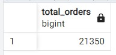
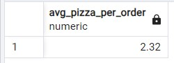
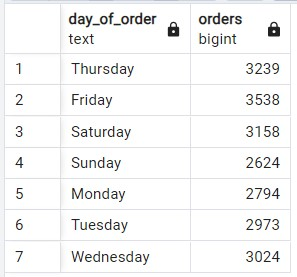
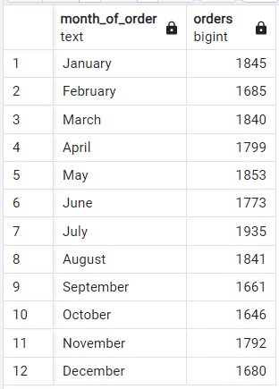
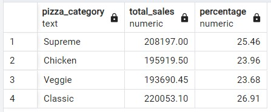
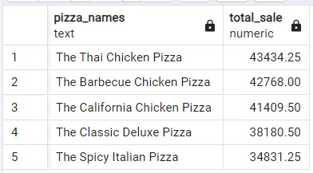
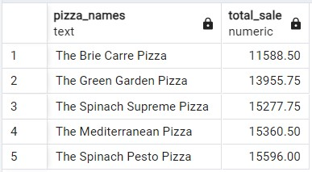
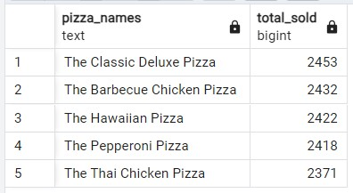
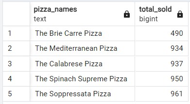

## Initial Queries
```sql
-- Check the raw data
SELECT *
FROM pizza_sales
LIMIT 10;

SELECT COUNT(pizza_id)
FROM pizza_sales;

-- Check data type of order_date column
SELECT order_date, pg_typeof(order_date) AS data_type
FROM pizza_sales;

-- Change data type of order_date from text to Date
ALTER TABLE pizza_sales
ADD COLUMN order_date_f DATE;

UPDATE pizza_sales
SET order_date_f = TO_DATE(order_date, 'DD-MM-YYYY');

SELECT order_date_f, pg_typeof(order_date_f) AS data_type
FROM pizza_sales;

ALTER TABLE pizza_sales
DROP COLUMN order_date;
```

## Total Revenue
```sql
SELECT ROUND(SUM(total_price), 2) AS Total_Revenue 
FROM pizza_sales;
```


## Average order Values
```sql
SELECT ROUND(SUM(total_price) / COUNT(DISTINCT order_id), 2) AS Avg_Order_Value 
FROM pizza_sales;
```


## Total Pizza Sold
```sql
SELECT SUM(quantity) AS pizza_sold
FROM pizza_sales;
```


## Total Orders
```sql
SELECT COUNT(DISTINCT order_id) AS total_orders
FROM pizza_sales;
```


## Average Pizzas Per Order
```sql
SELECT ROUND(CAST(SUM(quantity) AS DECIMAL) / COUNT(DISTINCT order_id) , 2) AS Avg_Pizza_Per_Order
FROM pizza_sales;
```


## Daily Trend
```sql
SELECT TO_CHAR(order_date_f, 'Day') AS day_of_order, COUNT (DISTINCT order_id) AS orders
FROM pizza_sales
GROUP BY day_of_order
ORDER BY MIN (order_date_f);
```

## Monthly Trend
```sql
SELECT TO_CHAR(order_date_f, 'Month') AS month_of_order, COUNT(DISTINCT order_id) AS orders
FROM pizza_sales
GROUP BY month_of_order
ORDER BY MIN(order_date_f);
```


## Sales Percentage of Pizza Category
```sql
SELECT pizza_category, ROUND(SUM(total_price), 2) AS total_sales, ROUND(SUM (total_price) / (SELECT SUM(total_price) FROM pizza_sales) * 100, 2) AS Percentage
FROM pizza_sales
GROUP BY pizza_category;
```


## Sales Percentage of Pizza Size
```sql
SELECT pizza_size, ROUND(SUM(total_price), 2) AS total_sales, ROUND(SUM (total_price) / (SELECT SUM(total_price) FROM pizza_sales) * 100, 2) AS Percentage
FROM pizza_sales
GROUP BY pizza_size;
```


## Top 5 Best Sellers by Revenue
```sql
SELECT TRIM(pizza_name) AS pizza_names, ROUND(SUM(total_price), 2) AS Total_Sale
FROM pizza_sales
GROUP BY pizza_names
ORDER BY Total_Sale DESC
LIMIT 5;
```


## Bottom 5 Sellers by Revenue
```sql
SELECT TRIM(pizza_name) AS pizza_names, ROUND(SUM(total_price), 2) AS Total_Sale
FROM pizza_sales
GROUP BY pizza_names
ORDER BY Total_Sale ASC
LIMIT 5;
```


## Top 5 Best Sellers by Quantity
```sql
SELECT TRIM(pizza_name) AS pizza_names, SUM(quantity) AS total_sold
FROM pizza_sales
GROUP BY pizza_names
ORDER BY total_sold DESC
LIMIT 5;
```


## Bottom 5 Sellers by Quantity
```sql
SELECT TRIM(pizza_name) AS pizza_names, SUM(quantity) AS total_sold
FROM pizza_sales
GROUP BY pizza_names
ORDER BY total_sold ASC
LIMIT 5;
```

